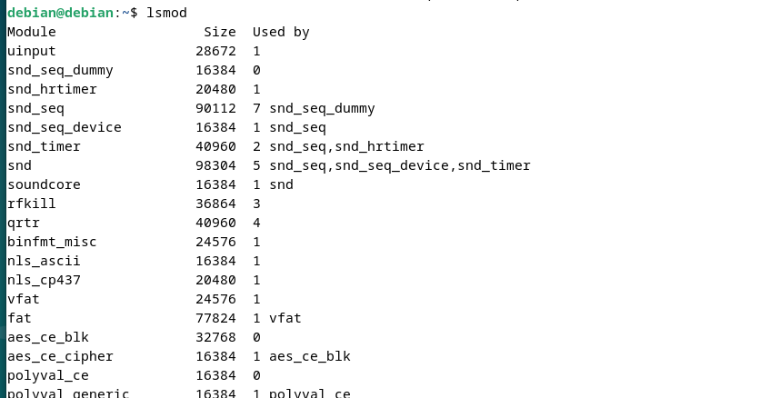
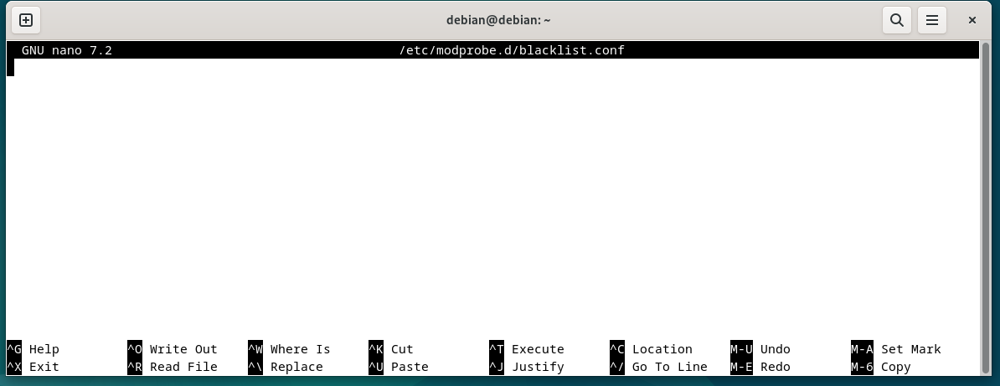
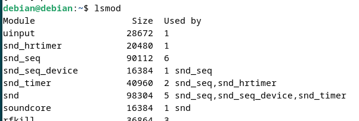
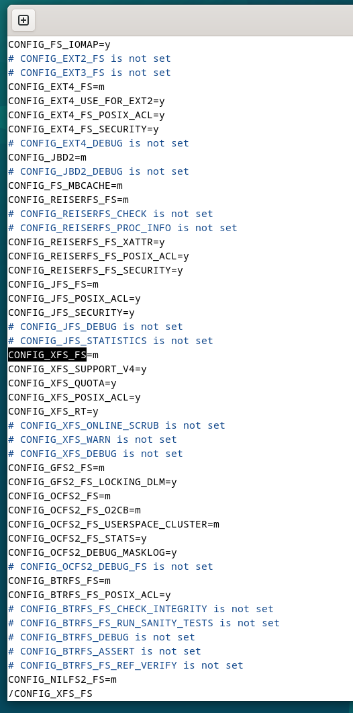
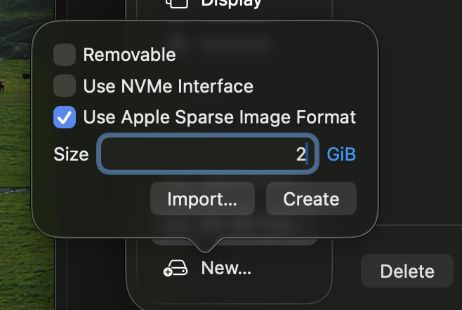

# Задание 1. Kernel and Module Inspection
### 1.1 Демонстрация версии ядра

Выполняю команду `uname -a`

Версия ядра в моем случае - 6.1.0-13-arm64

### 1.2 Просмотр всех загруженных модулей ядра

Выполняю команду `lsmod`

Вижу достаточно большое количество разных модулей
Список всех модулей:
|Module                 |  Size    |  Used by  |  Depends on                                      |
|-----------------------|----------|-----------|--------------------------------------------------|
|uinput                 |  28672   |  1        |                                                  |
|snd_seq_dummy          |  16384   |  0        |                                                  |
|snd_hrtimer            |  20480   |  1        |                                                  |
|snd_seq                |  90112   |  7        |  snd_seq_dummy                                   |
|snd_seq_device         |  16384   |  1        |  snd_seq                                         |
|snd_timer              |  40960   |  2        |  snd_seq, snd_hrtimer                            |
|snd                    |  98304   |  5        |  snd_seq, snd_seq_device, snd_timer              |
|soundcore              |  16384   |  1        |  snd                                             |
|rfkill                 |  36864   |  3        |                                                  |
|qrtr                   |  40960   |  4        |                                                  |
|binfmt_misc            |  24576   |  1        |                                                  
|nls_ascii              |  16384   |  1        |                                                  
|nls_cp437              |  20480   |  1        |                                                  
|vfat                   |  24576   |  1        |                                                  
|fat                    |  77824   |  1        |  vfat                                            
|aes_ce_blk             |  32768   |  0        |                                                  
|aes_ce_cipher          |  16384   |  1        |  aes_ce_blk                                      
|polyval_ce             |  16384   |  0        |                                                  
|polyval_generic        |  16384   |  1        |  polyval_ce                                      
|ghash_ce               |  20480   |  0        |                                                  
|gf128mul               |  16384   |  2        |  polyval_generic, ghash_ce                       
|sha3_ce                |  16384   |  0        |                                                  
|sha3_generic           |  16384   |  1        |  sha3_ce                                         
|sha512_ce              |  16384   |  0        |                                                  
|sha512_arm64           |  20480   |  1        |  sha512_ce                                       
|sha2_ce                |  16384   |  0        |                                                  
|sha256_arm64           |  24576   |  1        |  sha2_ce                                         
|joydev                 |  32768   |  0        |                                                  
|sha1_ce                |  16384   |  0        |                                                  
|virtio_balloon         |  28672   |  0        |                                                  
|virtio_console         |  45056   |  1        |                                                  
|virtiofs               |  32768   |  1        |                                                  
|apple_mfi_fastcharge   |  20480   |  0        |                                                  
|evdev                  |  28672   |  6        |                                                  
|fuse                   |  135168  |  6        |  virtiofs                                        
|dm_mod                 |  139264  |  0        |                                                  
|efi_pstore             |  16384   |  0        |                                                  
|loop                   |  36864   |  0        |                                                  
|configfs               |  49152   |  1        |                                                  
|dax                    |  32768   |  1        |  dm_mod                                          
|efivarfs               |  20480   |  1        |                                                  
|virtio_rng             |  16384   |  0        |                                                  
|ip_tables              |  32768   |  0        |                                                  
|x_tables               |  36864   |  1        |  ip_tables                                       
|autofs4                |  45056   |  2        |                                                  
|hid_generic            |  16384   |  0        |                                                  
|usbhid                 |  57344   |  0        |                                                  
|hid                    |  135168  |  2        |  usbhid, hid_generic                             
|ext4                   |  761856  |  1        |                                                  
|crc16                  |  16384   |  1        |  ext4                                            
|mbcache                |  20480   |  1        |  ext4                                            
|jbd2                   |  139264  |  1        |  ext4                                            
|crc32c_generic         |  16384   |  2        |                                                  
|virtio_gpu             |  69632   |  1        |                                                  
|virtio_dma_buf         |  16384   |  1        |  virtio_gpu                                      
|drm_shmem_helper       |  20480   |  1        |  virtio_gpu                                      
|drm_kms_helper         |  139264  |  3        |  virtio_gpu                                      
|drm                    |  442368  |  5        |  drm_kms_helper, drm_shmem_helper, virtio_gpu    
|virtio_net             |  57344   |  0        |                                                  
|virtio_blk             |  28672   |  4        |                                                  
|net_failover           |  20480   |  1        |  virtio_net                                      
|failover               |  16384   |  1        |  net_failover                                    
|xhci_pci               |  24576   |  0        |                                                  
|xhci_hcd               |  258048  |  1        |  xhci_pci                                        
|crct10dif_ce           |  16384   |  0        |                                                  
|crct10dif_common       |  16384   |  1        |  crct10dif_ce                                    
|usbcore                |  266240  |  4        |  xhci_hcd, usbhid, apple_mfi_fastcharge, xhci_pci
|usb_common             |  16384   |  2        |  xhci_hcd, usbcore                               
|virtio_pci             |  28672   |  0        |                                                  
|virtio_pci_legacy_dev  |  16384   |  1        |  virtio_pci                                      
v|irtio_pci_modern_dev  |  16384   |  1        |  virtio_pci                                      


### 1.3 Отключение автозагрузки модуля cdrom

Создаю файл конфигурации для предотвращения загрузки модулей 

Команда `sudo nano /etc/modprobe.d/blacklist.conf` 

Открылось окно редактирования файла

Добавляем в него `blacklist cdrom`

Модуля cdrom в моем случае изначально не было, так что я таким же образом отрубил snd_seq_dummy


После перезапуска виртуалки модуль действительно пропал из списка активных



### 1.4 Поиск и описание конфигурации ядра

Выполняю команду поиска файла конфигурации `ls -l /boot/config-$(uname -r)`


Открываю файл командой `vim /boot/config-6.1.0-13-arm64`


Вводим `/CONFIG_XFS_FS` и находим искомое значение


Этот параметр задает то, как настроена поддержка файловой системы XFS, в данном слачае она не встроена в само ядро, а предоставляется как модуль (параметр "m"). 

# Задание 2. Наблюдение за VFS
### 2.1 Анализ команды с помощью strace
Выполняю команду ``strace -e trace=openat,read,write,close cat /etc/os-release > /dev/null``

Получаю следующий вывод

```
openat(AT_FDCWD, "/etc/ld.so.cache", O_RDONLY|O_CLOEXEC) = 3
close(3)                                = 0
openat(AT_FDCWD, "/lib/aarch64-linux-gnu/libc.so.6", O_RDONLY|O_CLOEXEC) = 3
read(3, "\177ELF\2\1\1\3\0\0\0\0\0\0\0\0\3\0\267\0\1\0\0\0py\2\0\0\0\0\0"..., 832) = 832
close(3)                                = 0
openat(AT_FDCWD, "/usr/lib/locale/locale-archive", O_RDONLY|O_CLOEXEC) = 3
close(3)                                = 0
openat(AT_FDCWD, "/etc/os-release", O_RDONLY) = 3
read(3, "PRETTY_NAME=\"Debian GNU/Linux 12"..., 131072) = 267
write(1, "PRETTY_NAME=\"Debian GNU/Linux 12"..., 267) = 267
read(3, "", 131072)                     = 0
close(3)                                = 0
close(1)                                = 0
close(2)                                = 0
+++ exited with 0 +++
```

Эта команда показывает системные вызовы, которые происходят при выполнении 
команды ``cat /etc/os-release > /dev/null``, с отслеживанием операций открытия, чтения, записи и закрытия файлов

Сначала идет открытие ``/etc/ld.so.cache`` - файл, хранящий кэши для ускорения поиска библиотек в системе

Дальше идет открытие библиотеки libc ``/lib/aarch64-linux-gnu/libc.so.6`` и проверка ELF-паспорта - это нужно, чтобы безопасно и корректно загрузить библиотеку в память

Дальше мы открываем архив локалей ``/usr/lib/locale/locale-archive`` - это необходимо для корректной работы с кодировками при чтении/записи

Далее мы открываем необходимый нам файл ``/etc/os-release`` - конфигурационный файл с данными о версии и названии ОС, и считываем оттуда все. Строчка с = 0 обозначает, что мы достигли конца файла

Далее вызывается ``write``, который показывает запись в stdout - ``cat`` не знает о том, что данные никуда не попадут, так что просто вызывает ``write``.

Но так как вывод перенаправлен в ``/dev/null`` - то данные никуда не сохранятся, по сути просто потеряются.

``close(3)`` закрывает файл после чтения, ``close(1)`` и ``close(2)`` — это завершение стандартных потоков при выходе

``+++ exited with 0 +++`` - успешное завершение работы без ошибок

# Задание 3. LVM Management
### 3.1 Добавление диска к виртуальной машине

Создаю новый диск в виртуалке 

### 3.2 Создание раздела на /dev/vdb

Добавляю новый раздел командой ``sudo fdisk /dev/vdb``
Попадаем в интерфейс fdisc

Вводим команду ``n`` для создания раздела. Partition type выбираем primary, количество партиций - 1, начало и конец также по умолчанию.

Партиция успешно создана


### 3.3 Создание Physical Volume

Вызываем команду ``sudo pvcreate /dev/vdb1``

Получаем сообщение об успешном создании 
`Physical volume "/dev/vdb1" successfully created.`

### 3.4 Создание Volume Group

Вызываем команду ``sudo vgcreate vg_highload /dev/vdb1``

олучаем сообщение об успешном создании 
`Volume group "vg_highload" successfully created`

### 3.4 Создание Volume Group

Вызываем команду ``sudo vgcreate vg_highload /dev/vdb1``

Получаем сообщение об успешном создании 
`Volume group "vg_highload" successfully created`

### 3.5 Создание Logical Volumes

Создаем первый том на 1200 Mib, для этого выполняем ``sudo lvcreate -L 1200M -n data_lv vg_highload``

Получаем сообщение об успешном создании тома ``Logical volume "data_lv" created.``

Создаем второй том на оставшееся место ``sudo lvcreate -l 100%FREE -n logs_lv vg_highload`` 

Получаем сообщение об успешном создании тома ``Logical volume "logs_lv" created.``

### 3.6 Форматирование и монтирование data_lv (ext4)

Форматируем том data_lv в ext4 ``sudo mkfs.ext4 /dev/vg_highload/data_lv``

Получаем сообщение об успешном форматировании
```
mke2fs 1.47.0 (5-Feb-2023)
Discarding device blocks: done                            
Creating filesystem with 307200 4k blocks and 76800 inodes
Filesystem UUID: 74b6908e-beff-4b82-921b-97bf3ee38ce7
Superblock backups stored on blocks: 
	32768, 98304, 163840, 229376, 294912

Allocating group tables: done                            
Writing inode tables: done                            
Creating journal (8192 blocks): done
Writing superblocks and filesystem accounting information: done
```

Далее создаем точку монтирования ``sudo mkdir -p /mnt/app_data``

И проводим монтирование ``sudo mount /dev/vg_highload/data_lv /mnt/app_data``

### 3.7 Форматирование и монтирование data_lv (ext4)

Форматируем том data_lv в ext4 ``sudo mkfs.xfs /dev/vg_highload/logs_lv``

Получаем сообщение об успешном форматировании
```
meta-data=/dev/vg_highload/logs_lv isize=512    agcount=4, agsize=54016 blks
         =                       sectsz=512   attr=2, projid32bit=1
         =                       crc=1        finobt=1, sparse=1, rmapbt=0
         =                       reflink=1    bigtime=1 inobtcount=1 nrext64=0
data     =                       bsize=4096   blocks=216064, imaxpct=25
         =                       sunit=0      swidth=0 blks
naming   =version 2              bsize=4096   ascii-ci=0, ftype=1
log      =internal log           bsize=4096   blocks=16384, version=2
         =                       sectsz=512   sunit=0 blks, lazy-count=1
realtime =none                   extsz=4096   blocks=0, rtextents=0
Discarding blocks...Done.

```

Далее создаем точку монтирования ``sudo mkdir -p /mnt/app_logs``

И проводим монтирование ``sudo mount /dev/vg_highload/logs_lv /mnt/app_logs``

# Задание 4. LVM Management

### 4.1 Извлечение модели CPU и объёма памяти из /proc

Выполняем команду по поиску модели CPU ``cat /proc/cpuinfo | grep "model name" | head -1``
К соажлению названия CPU не получилось найти, в файле cpuinfo нет названия модели, она должна лежать под названием "model name"

Выполняем команду по поиску текущего объема памяти - ``cat /proc/meminfo | grep MemTotal``
Получаем ответ о текущем объеме - ``MemTotal:        4018576 kB``

### 4.2 Поиск Parent Process ID (PPid) текущего shell

Выполняем команду ``cat /proc/$$/status | grep PPid``
Видим текущий id shell ``PPid:	1972``

### 4.3 Определение настроек I/O scheduler для /dev/vda

Выполняем команду ``cat /sys/block/vda/queue/scheduler``

Видим текущие настройки``[mq-deadline] none``

### 4.4 Определение размера MTU для сетевого интерфейса

``ip a``

```
1: lo: <LOOPBACK,UP,LOWER_UP> mtu 65536 qdisc noqueue state UNKNOWN group default qlen 1000
    link/loopback 00:00:00:00:00:00 brd 00:00:00:00:00:00
    inet 127.0.0.1/8 scope host lo
       valid_lft forever preferred_lft forever
    inet6 ::1/128 scope host noprefixroute 
       valid_lft forever preferred_lft forever
2: enp0s1: <BROADCAST,MULTICAST,UP,LOWER_UP> mtu 1500 qdisc fq_codel state UP group default qlen 1000
    link/ether b2:10:6f:db:23:e0 brd ff:ff:ff:ff:ff:ff
    inet 192.168.0.220/24 brd 192.168.0.255 scope global dynamic noprefixroute enp0s1
       valid_lft 5577sec preferred_lft 5577sec
    inet6 fe80::b010:6fff:fedb:23e0/64 scope link noprefixroute 
       valid_lft forever preferred_lft forever
```


