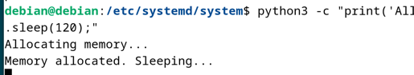
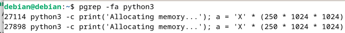
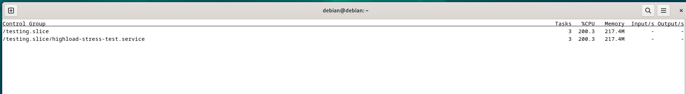

## Задание 1. Systemd
### 1.1 Bash-скрипт для systemd сервиса

Создаю скрипт `/usr/local/bin/homework_service.sh`:

Выполняю команду `sudo touch homework_service.sh`

И добавляю в него следующий код с помощью ``sudo vim homework_service.sh``:
```
#!/bin/bash
echo "My custom service has started."
while true; do
    echo "Service heartbeat: $(date)" >> /tmp/homework_service.log
    sleep 15
done

```
Делаю скрипт исполняемым:
``sudo chmod +x homework_service.sh``
### 1.2 Systemd unit-файл

Создаю файл `/etc/systemd/system/homework.service`:
```
[Unit]
Description=Homework custom service
After=network.target

[Service]
Type=simple
ExecStart=/usr/local/bin/homework_service.sh
Restart=on-failure
RestartSec=15
StandardOutput=journal
StandardError=journal
WorkingDirectory=/

[Install]
WantedBy=multi-user.target
```
### 1.3 Запуск и проверка сервиса

Запускаю сервис через systemd и смотрю что он работает:
```
sudo systemctl enable --now homework.service
sudo systemctl status homework.service -n 10
sudo tail -f /tmp/homework_service.log
```
**Вывод в консоли:**
```angular2html
homework.service
     Loaded: loaded (/etc/systemd/system/homework.service; enabled; preset: enabled)
     Active: active (running) since Sat 2025-10-04 02:49:54 PDT; 15s ago
   Main PID: 26688 (homework_servic)
      Tasks: 2 (limit: 4567)
     Memory: 528.0K
        CPU: 5ms
     CGroup: /system.slice/homework.service
             \u251c\u250026688 /bin/bash /usr/local/bin/homework_service.sh
             \u2514\u250026696 sleep 15

Oct 04 02:49:54 debian systemd[1]: Started homework.service.
Oct 04 02:49:54 debian homework_service.sh[26688]: my custom service has started
Oct 04 02:50:00 debian systemd[1]: /etc/systemd/system/homework.service:1: Unknown section 'Uint'. Ignoring.

```
Видим, что сервис запущен и работает.
Далее отправим SIGKILL для проверки рестарта:
```
systemctl kill --signal=SIGKILL homework.service
```

Видим, что сервис умер и перезапустится через 15 секунд:
```
homework.service
     Loaded: loaded (/etc/systemd/system/homework.service; enabled; preset: enabled)
     Active: activating (auto-restart) (Result: signal) since Sat 2025-10-04 03:11:03 PDT; 1s ago
    Process: 26950 ExecStart=/usr/local/bin/homework_service.sh (code=killed, signal=KILL)
   Main PID: 26950 (code=killed, signal=KILL)
        CPU: 38ms

Oct 04 03:11:03 debian systemd[1]: homework.service: Main process exited, code=killed, status=9/KILL
Oct 04 03:11:03 debian systemd[1]: homework.service: Failed with result 'signal'.
```
После рестарта он успешно поднялся:
```angular2html
homework.service
Loaded: loaded (/etc/systemd/system/homework.service; enabled; preset: enabled)
Active: active (running) since Sat 2025-10-04 03:11:18 PDT; 30s ago
Main PID: 27008 (homework_servic)
Tasks: 2 (limit: 4567)
Memory: 532.0K
CPU: 9ms
CGroup: /system.slice/homework.service
\u251c\u250027008 /bin/bash /usr/local/bin/homework_service.sh
\u2514\u250027014 sleep 15

Oct 04 03:11:18 debian systemd[1]: Started homework.service.
Oct 04 03:11:18 debian homework_service.sh[27008]: my custom service has started

```
### 1.4 Анализ длительно стартующих юнитов
Для анализа длительно стартующих юнитов выполняю:
```
systemd-analyze blame | head -n 5
```
**Вывод в консоли:**
```
11.869s plymouth-quit-wait.service
325ms man-db.service
289ms apt-daily.service
279ms apt-daily-upgrade.service
191ms systemd-journald.service
```
## Задание 2. IPC: Разделяемая память

### 2.1 Исходный код и компиляция

Создаю файл `shm_creator.c` командой `sudo touch shm_creator.c`, далее захожу в него через `sudo vim shm_creator.c` и добавляю следующий код:
```angular2html
#include <stdio.h>
#include <stdlib.h>
#include <sys/ipc.h>
#include <sys/shm.h>
#include <unistd.h>


int main() {
    key_t key = ftok("homework_key", 65); // Generate a unique key
    int shmid = shmget(key, 1024, 0666|IPC_CREAT); // Create 1KB segment
    if (shmid == -1) {
        perror("shmget");
        exit(1);
    }

    printf("Shared memory segment created.\n");
    printf("ID: %d\nKey: 0x%x\n", shmid, key);
    printf("Run 'ipcs -m' to see it. Process will exit in 60 seconds...\n");
    sleep(60);
    shmctl(shmid, IPC_RMID, NULL); // Clean up
    printf("Shared memory segment removed.\n");
    return 0;
}
```

Далее компилирую код и запускаю программу:
```angular2html
gcc shm_creator.c -o shm_creator
touch homework_key
./shm_creator
```

### 2.2 Анализ сегмента памяти
Выполняю в отдельном окне терминала команду, чтобы увидеть созданный сегмент:
```angular2html
ipcs -m
```

**Пример вывода:**
```angular2html
------ Shared Memory Segments --------
key        shmid      owner      perms      bytes      nattch     status
0x4102e042 4          debian     666        1024       0                       
```
`nattch=0` — ни один процесс не присоединился через shmat(), только создан сегмент.
По истечении 60 секунд сегмент удаляется

## Задание 3. Анализ памяти процессов (VSZ vs RSS)
### 3.1 Запуск питон-скрипта
Выполняю следующую команду:
```angular2html
python3 -c "print('Allocating memory...'); a = 'X' * (250 * 1024 * 1024); import time; print('Memory allocated. Sleeping...'); time.sleep(120);"
```
Скрипт успешно запущен

### 3.2 Анализ использования памяти
Находим PID процесса:
```angular2html
pgrep -fa python3
```
Видим наши процессы:

Проверяем использование памяти одним из процессов:
```angular2html
ps -o pid,user,%mem,rss,vsz,comm -p 27114
```

**Пример вывода:**
```angular2html
PID   USER    %MEM   RSS    VSZ    COMMAND
27114 debian  6.5    264288 271880 python3

```
- **VSZ**: всё адресное пространство процесса
- **RSS**: фактически занятая физическая память

Видим, что VSZ больше RSS - это значит, что для процесс выделено 271мб адресного пространства, но реально используется только 264мб физической памяти

## Задание 4. NUMA и CGroups 
### 4.1 NUMA: количество нод и память

Выполняю команду, чтбы понять текущее количество NUMA-нод:
```angular2html
lscpu | grep -i numa
```

В результате вижу:
```angular2html
NUMA node(s):                            1
NUMA node0 CPU(s):                       0-3
```

Выполняю команду, чтобы узнать сколько памяти на ноде:
```angular2html
numactl --hardware
```
В результате вижу:
```angular2html
available: 1 nodes (0)
node 0 cpus: 0 1 2 3
node 0 size: 3924 MB
node 0 free: 1854 MB
node distances:
node   0
0:  10
```

По итогу видим, что у меня одна нода с 3924мб памяти, из которых свободно 1854мб. Таблица расстояний показывает, что у ноды расстояние до самой себя 10 (минимальное значение)
### 4.2 systemd-run с ограничениями и анализом
Устанавливаю утилиту stress:
```angular2html
sudo apt install -y stress
```

Запускаю команду с ограничением памяти 150Мб и нагрузкой на CPU:
```angular2html
sudo systemd-run --unit=highload-stress-test --slice=testing.slice
--property=MemoryMax=150M --property=CPUWeight=100
stress --cpu 1 --vm 1 --vm-bytes 300M --timeout 30s
```

Вижу, что юнит запустился:
```angular2html
sudo systemctl status highload-stress-test.service
```
```angular2html
highload-stress-test.service - /usr/bin/stress --cpu 1 --vm 1 --vm-bytes 300M --timeout 30s
     Loaded: loaded (/run/systemd/transient/highload-stress-test.service; transient)
  Transient: yes
     Active: active (running) since Sun 2025-10-05 03:48:08 PDT; 29s ago
   Main PID: 2501 (stress)
      Tasks: 3 (limit: 4567)
     Memory: 149.9M (max: 150.0M available: 48.0K)
        CPU: 49.099s
     CGroup: /testing.slice/highload-stress-test.service
             \u251c\u25002501 /usr/bin/stress --cpu 1 --vm 1 --vm-bytes 300M --timeout 30s
             \u251c\u25002502 /usr/bin/stress --cpu 1 --vm 1 --vm-bytes 300M --timeout 30s
             \u2514\u25002503 /usr/bin/stress --cpu 1 --vm 1 --vm-bytes 300M --timeout 30s

```

Но выше порога памяти процесс не поднимается, так как установлен лимит в 150Мб
Выполняю ```systemctl status testing.slice```, чтобы в этом убедиться дополнительно:

```angular2html
testing.slice - Slice /testing
Loaded: loaded
Active: active since Sun 2025-10-05 03:48:08 PDT; 7min ago
Tasks: 3
Memory: 149.9M
CPU: 2min 13.663s
CGroup: /testing.slice
\u2514\u2500highload-stress-test.service
\u251c\u25002628 /usr/bin/stress --cpu 1 --vm 1 --vm-bytes 300M --timeout 30s
\u251c\u25002629 /usr/bin/stress --cpu 1 --vm 1 --vm-bytes 300M --timeout 30s
\u2514\u25002630 /usr/bin/stress --cpu 1 --vm 1 --vm-bytes 300M --timeout 30s
```
По идее сервис должен упасть с ошибкой OOM, но этого не происходит

Вероятнее всего используется swap, и при достижении границы MemoryMax система просто начинает свопать память на диск.

Отключаю swap для конкретного процесса, дописав ``---property=MemorySwapMax=0`` и пробую снова:
```angular2html
sudo systemd-run --unit=highload-stress-test --slice=testing.slice --property=MemoryMax=150M --property=CPUWeight=100 --property=MemorySwapMax=0 stress --cpu 1 --vm 1 --vm-bytes 300M --timeout 30s
```
Теперь вижу, что процесс упал с ошибкой OOM:
```angular2html
sudo systemctl status highload-stress-test.service
```
```angular2html
highload-stress-test.service - /usr/bin/stress --cpu 1 --vm 1 --vm-bytes 300M --timeout 30s
Loaded: loaded (/run/systemd/transient/highload-stress-test.service; transient)
Transient: yes
Active: failed (Result: oom-kill) since Sun 2025-10-05 05:36:43 PDT; 1min 17s ago
Duration: 60ms
Process: 5471 ExecStart=/usr/bin/stress --cpu 1 --vm 1 --vm-bytes 300M --timeout 30s (code=exited, status=1/FAILURE)
Main PID: 5471 (code=exited, status=1/FAILURE)
CPU: 106ms

Oct 05 05:36:43 debian systemd[1]: Started highload-stress-test.service - /usr/bin/stress --cpu 1 --vm 1 --vm-bytes 300M --timeout 30s.
Oct 05 05:36:43 debian stress[5471]: stress: info: [5471] dispatching hogs: 1 cpu, 0 io, 1 vm, 0 hdd
Oct 05 05:36:43 debian stress[5471]: stress: FAIL: [5471] (425) <-- worker 5473 got signal 9
Oct 05 05:36:43 debian stress[5471]: stress: WARN: [5471] (427) now reaping child worker processes
Oct 05 05:36:43 debian stress[5471]: stress: FAIL: [5471] (461) failed run completed in 0s
Oct 05 05:36:43 debian systemd[1]: highload-stress-test.service: A process of this unit has been killed by the OOM killer.
Oct 05 05:36:43 debian systemd[1]: highload-stress-test.service: Main process exited, code=exited, status=1/FAILURE
Oct 05 05:36:43 debian systemd[1]: highload-stress-test.service: Failed with result 'oom-kill'.

```
В системном журнале также появилась запись об убийстве процесса:
```angular2html
journalctl -u highload-stress-test 
```
```angular2html
Oct 05 05:36:43 debian systemd[1]: Started highload-stress-test.service - /usr/bin/stress --cpu 1 --vm 1 --vm-bytes 300M --timeout 30s.
Oct 05 05:36:43 debian stress[5471]: stress: info: [5471] dispatching hogs: 1 cpu, 0 io, 1 vm, 0 hdd
Oct 05 05:36:43 debian stress[5471]: stress: FAIL: [5471] (425) <-- worker 5473 got signal 9
Oct 05 05:36:43 debian stress[5471]: stress: WARN: [5471] (427) now reaping child worker processes
Oct 05 05:36:43 debian stress[5471]: stress: FAIL: [5471] (461) failed run completed in 0s
Oct 05 05:36:43 debian systemd[1]: highload-stress-test.service: A process of this unit has been killed by the OOM killer.
Oct 05 05:36:43 debian systemd[1]: highload-stress-test.service: Main process exited, code=exited, status=1/FAILURE
Oct 05 05:36:43 debian systemd[1]: highload-stress-test.service: Failed with result 'oom-kill'.
```

### 4.3 systemd-cgls
Для визуализации слайса testing.slice выполняю:
```angular2html
systemd-cgls --no-pager /testing.slice
```
Во время выполнения негрузочного теста вижу:
```angular2html
Control group /testing.slice:
\u2514\u2500highload-stress-test.service (#10177)
  \u2192 user.invocation_id: 56dbcdbde9374e1ca17e311b2625b3a1
  \u251c\u25005572 /usr/bin/stress --cpu 1 --vm 1 --vm-bytes 300M --timeout 30s
  \u251c\u25005573 /usr/bin/stress --cpu 1 --vm 1 --vm-bytes 300M --timeout 30s
  \u2514\u25005574 /usr/bin/stress --cpu 1 --vm 1 --vm-bytes 300M --timeout 30s
```
Для отслеживания изменений использования ресурсов выполняю:
```angular2html
systemd-cgtop /testing.slice
```

Вижу потребление памяти и CPU единственным процессом в слайсе:



### 4.4 Пояснения к MemoryMax и CPUWeight
- **MemoryMax** — максимальный предел RAM для процессов слайса/cgroup. Ядро убивает процессы при попытке превысить лимит
- **CPUWeight** — относительный вес при распределении CPU между cgroups. Им можно регулировать, сколько процентов от процессорного времени реально получит каждый процесс

